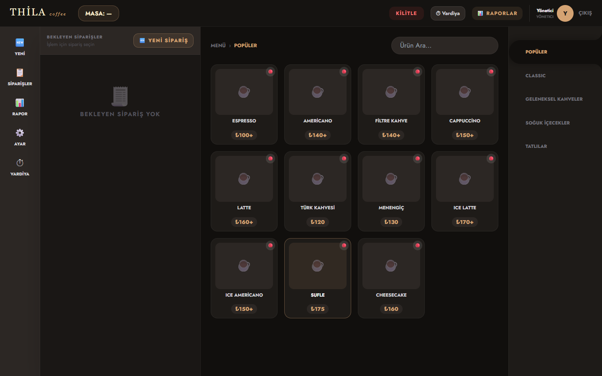
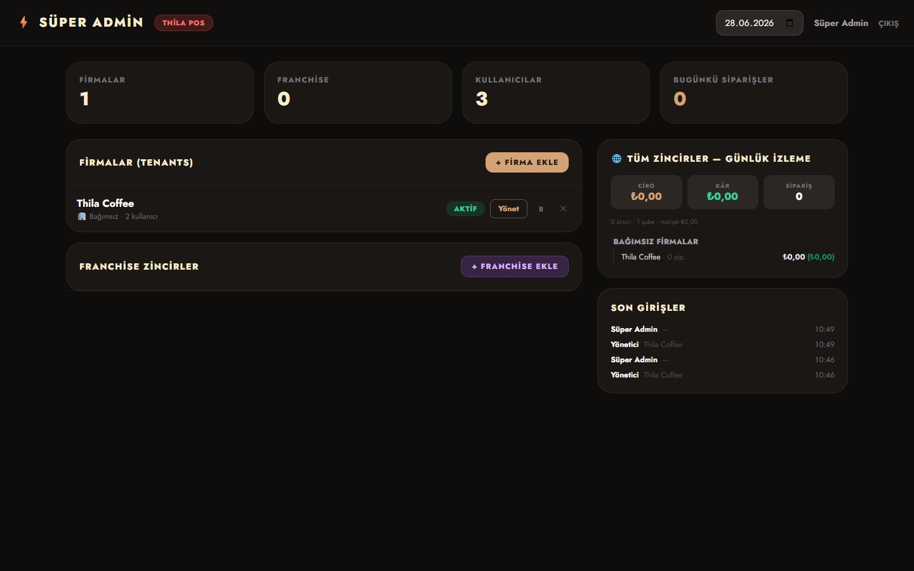
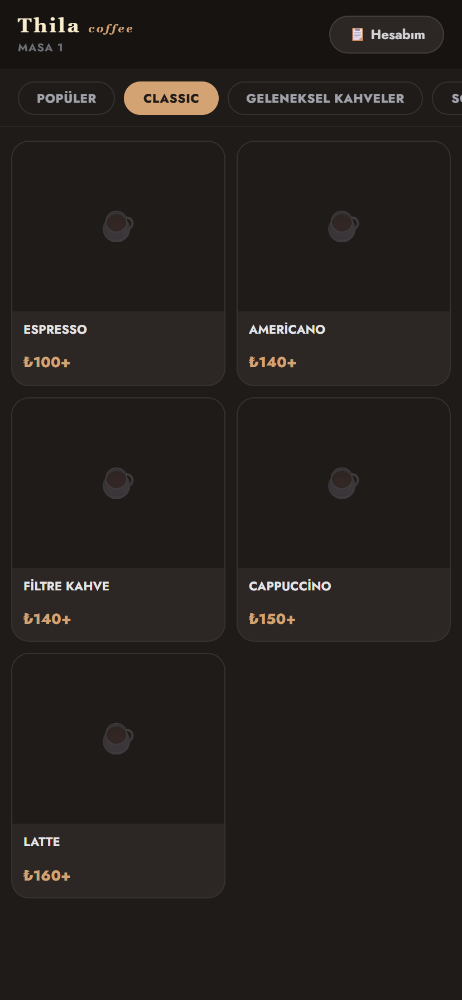
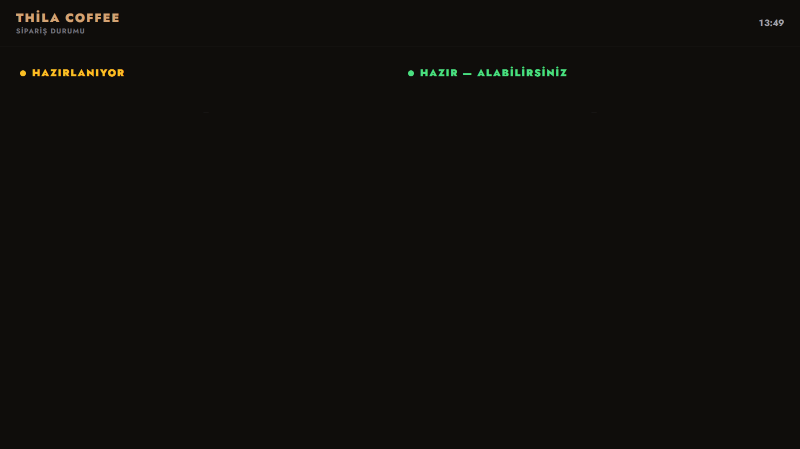

# Multi-Tenant Restaurant POS & Self-Service QR Ordering

> **Showcase / vitrin reposu.** Bu depo, kişisel olarak geliştirdiğim ticari bir
> kafe/restoran yazılımının **mimarisini ve seçilmiş kod örneklerini** sergiler.
> Çalışan ürünün tamamı değildir; amaç çözülen problemleri ve kod kalitesini
> göstermektir. Kaynak kodun tamamı özeldir (bkz. [LICENSE](LICENSE)).

**Stack:** PHP 8.2 · Laravel 12 · MySQL · Blade · Vanilla JS · Docker · ESC/POS

---

## TL;DR (for reviewers)

Tek geliştirici olarak sıfırdan tasarlayıp geliştirdiğim, **çok kiracılı (multi-tenant)**
ve **franchise destekli** bir restoran satış-noktası (POS) + **self-servis QR sipariş**
platformu. Üretim için Docker ile paketlenmiştir.

Bu repoda göreceğiniz şey, "tutorial projesi" değil; **eşzamanlılık, veri izolasyonu,
güvenlik ve para hesapları** gibi gerçek üretim problemlerinin nasıl çözüldüğüdür.

| Ne kanıtlıyor | Nerede |
|---------------|--------|
| Çok kiracılı veri izolasyonu (global scope) | [`HasTenant` trait](code-highlights/HasTenant.php) |
| Eşzamanlılık / yarış-durumu güvenliği | [Sıra-no üretimi (lockForUpdate + transaction)](code-highlights/order-number-race-safe.php) |
| Olay-tabanlı tek-nokta iş kuralı | [Stok düşümü (model events)](code-highlights/OrderItem-stock-events.php) |
| Güvenlik (hash + brute-force koruması) | [PIN doğrulama (RateLimiter)](code-highlights/verifyPin-bruteforce.php) |
| Karmaşık para hesapları (computed attributes) | [`Order` para mantığı](code-highlights/Order-money.php) |
| Mimari kararlar | [docs/ARCHITECTURE.md](docs/ARCHITECTURE.md) |

---

## Ne yapar?

- **Çok kiracılı franchise mimarisi** — Süper Admin → Franchise → Şube (tenant) →
  Admin/Garson rol hiyerarşisi. Her satır `tenant_id` ile izole; bir şubenin verisi
  diğerine sızmaz. Süper admin tüm zinciri tek panodan izler.
- **Self-servis QR sipariş** — Müşteri masadaki QR'ı okutur, KVKK aydınlatma + açık
  rıza onayıyla **ödemesiz** sipariş bırakır; sipariş anında kasaya ve mutfak ekranına
  düşer.
- **POS** — Adisyon, ikram, iskonto, hesap bölme (ürün/kişi/eşit), karışık ödeme
  (nakit+kart), gerçek-zamanlı yeni sipariş bildirimi.
- **Stok takibi** — Ürün bazlı stok + kritik eşik; satışta otomatik düşüm (tüm sipariş
  kanallarından tek noktadan).
- **Termal fiş** — ESC/POS ağ yazıcısı; yazıcı yoksa HTML/tarayıcı fişine fallback.
- **Raporlar** — Günlük/dönemsel/kâr-zarar, CSV dışa aktarım, denetim & giriş logları,
  vardiya, gider takibi.

---

## Öne çıkan teknik problemler ve çözümleri

### 1. Çok kiracılı izolasyon — tek satır kod ile her sorguda
Her tenant'a ait modele eklenen `HasTenant` trait'i, bir **global scope** ile o anki
aktif `tenant_id`'yi otomatik uygular; ayrıca `creating` olayında yeni kayıtlara
`tenant_id`'yi otomatik yazar. Böylece her controller'da `where('tenant_id', ...)`
tekrarına gerek kalmaz ve **unutmaya bağlı veri sızıntısı riski ortadan kalkar.**
→ [`code-highlights/HasTenant.php`](code-highlights/HasTenant.php)

### 2. Eşzamanlı self-servis siparişlerde çakışan sıra numarası
Aynı anda iki müşteri QR'dan sipariş verdiğinde ikisi de aynı "Sipariş #5" numarasını
alabilirdi. Çözüm: sıra numarasını **`DB::transaction` içinde `lockForUpdate()` ile**
üretmek → satır kilidi sayesinde eşzamanlı isteklerde çakışma olmaz.
→ [`code-highlights/order-number-race-safe.php`](code-highlights/order-number-race-safe.php)

### 3. Stok düşümünü tek noktada toplamak
Sipariş üç farklı kanaldan gelebiliyor (POS, self-servis QR, paket). Stok düşümünü her
kanala ayrı yazmak yerine **`OrderItem` model event'lerine** (`created`/`deleted`/
`updated`) bağladım → hangi kanaldan gelirse gelsin stok tutarlı kalır, kod tekrarı olmaz.
→ [`code-highlights/OrderItem-stock-events.php`](code-highlights/OrderItem-stock-events.php)

### 4. Yönetici PIN'i: hash + brute-force koruması
POS içi yetki yükseltme PIN'leri düz metin değil **hash'li** saklanır (`Hash::check`),
ve `RateLimiter` ile **yalnızca başarısız denemeler** sayılarak brute-force engellenir
(doğru PIN sayacı sıfırlar).
→ [`code-highlights/verifyPin-bruteforce.php`](code-highlights/verifyPin-bruteforce.php)

### 5. Para hesapları: tek doğruluk kaynağı + birim testler
Ara toplam, kalan, fazla ödeme, ikram, hesap bölme gibi para mantığı `Order` modelinde
**computed attribute** olarak tek yerde toplanır ve **birim testlerle** korunur.
→ [`code-highlights/Order-money.php`](code-highlights/Order-money.php)

---

## Ekran görüntüleri

**POS / kasa ekranı** — adisyon, bekleyen siparişler, kategori bazlı menü:

**Süper admin konsolidasyon panosu** — tüm firmalar/franchise zincirleri, günlük ciro & kâr izleme:

| Self-servis QR menü (mobil) | Mutfak / sipariş durumu ekranı |
|:---:|:---:|
|  |  |

---

## Mimari

Kısa özet için → [docs/ARCHITECTURE.md](docs/ARCHITECTURE.md)

---

## Notlar

- Bu bir **ön muhasebe / sipariş yönetimi** katmanıdır; yasal yazarkasanın (ÖKC) yerine
  geçmez, onun yanında çalışır.
- Kaynak kodun tamamı özeldir; tam koda erişim **talep üzerine** (ör. teknik mülakat)
  sağlanabilir.

---

## İletişim

**Yavuz** · [GitHub @yavuzscnplt](https://github.com/yavuzscnplt) · yavuz7500@gmail.com
